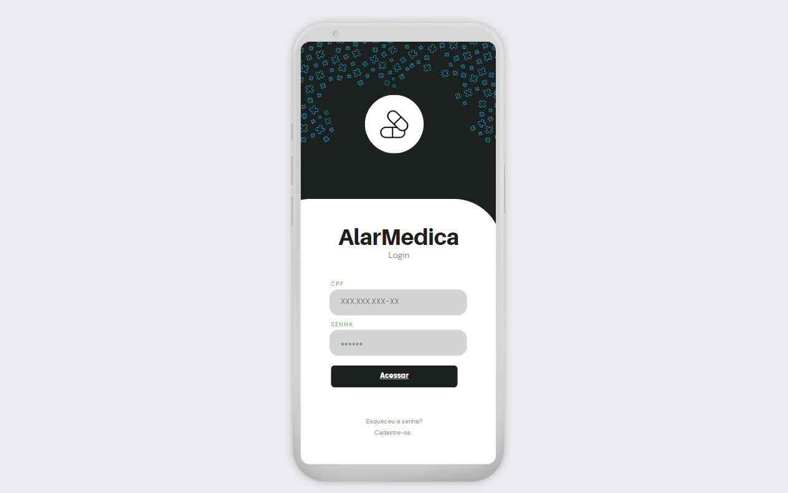
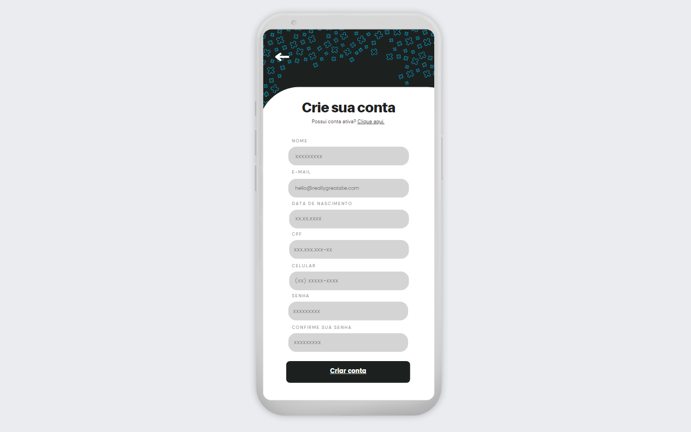
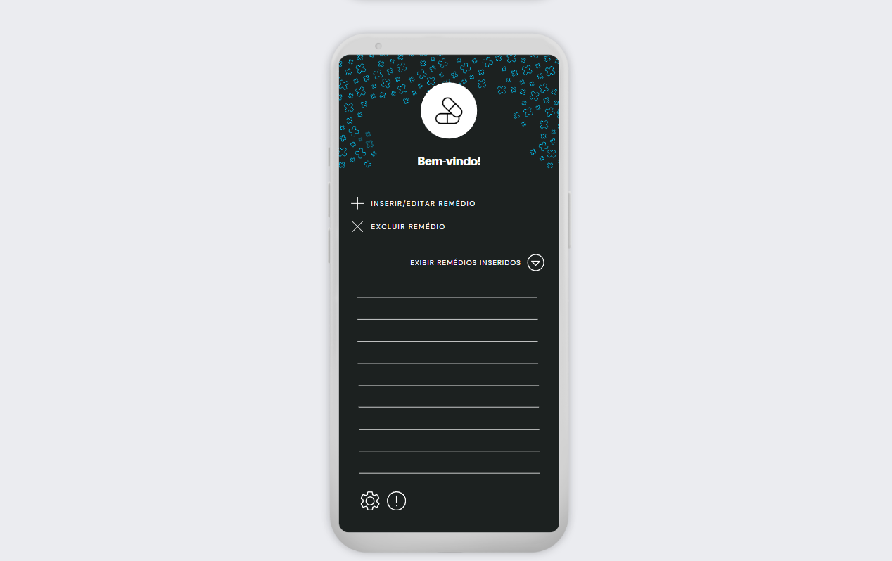
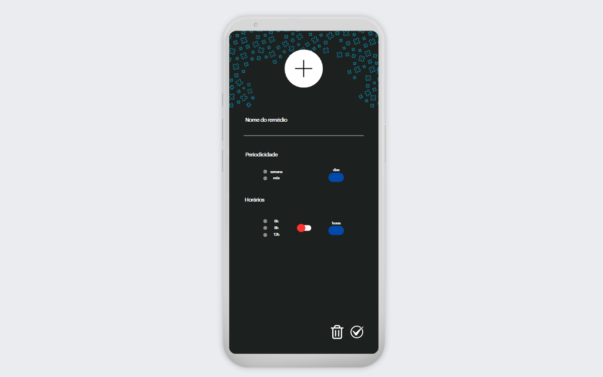
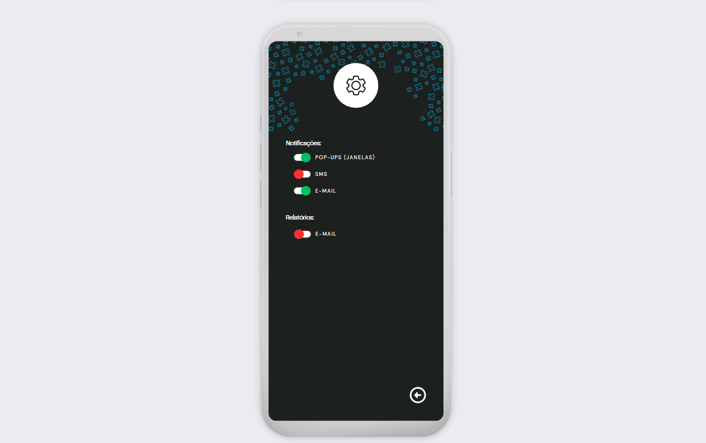
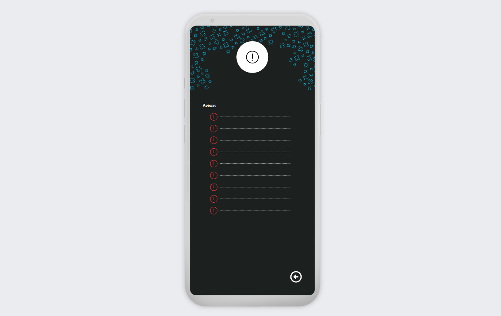
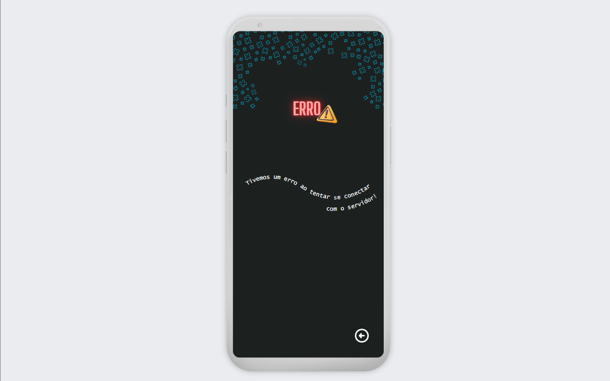

# Descrição
Esse repositório traz documentos e imagens referentes à primeira entrega da disciplina *Projeto Integrador IV: Desenvolvimento de Sistemas Orientados a Dispositivos Móveis e Baseados na Web* do curso de **Análise e Desenvolvimento de Sistemas**, dentro do **Centro Universitário Senac**. Os integrantes do **grupo 05** são:
* [Alessandro Alves Damasceno](https://github.com/alessandroAlves1)
* [Ana Cláudia de Souza Santos ](https://github.com/souzsana)
* [Carolina Moreira Batatinha de Souza ](https://github.com/CarolinaBatatinha)
* [Elen Alice dos Reis Nicolini ](https://github.com/ElenReis)
* [Nathan Barros de Assis](https://github.com/onatao)

# Protótipo da interface

Os protótipos utilizados na apresentação desse projeto estão exibidos dentro [desse link](https://www.canva.com/design/DAGQG5byvUc/NDXAO3ZVDgCgiygB2HubZg/edit) na plataforma **Canva** e estão representados nas capturas abaixo:

- **Tela de acesso 1**:   

*Representa a tela de login.*

- **Tela de acesso 2**:  

*Demonstra a tela de criação de conta.*

- **Tela de acesso 3**:  

*Ilustra as opções de edição dentro da tela inicial.*

- **Tela de acesso 4**:  

*Ilustra as opções avançadas de inserção/ alteração de frequências e horários das administrações.*

- **Tela de acesso 5**:

*Disponibiliza a tela de notificações e relatórios.*

- **Tela de acesso 6**:  

*Representa a tela de avisos.*

- **Tela de acesso 7**:  

*Tela de erro.*

